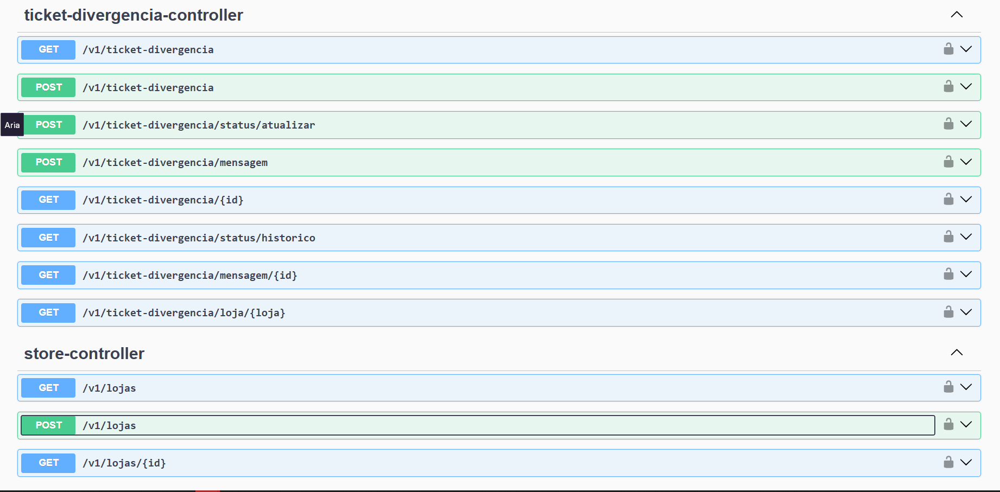
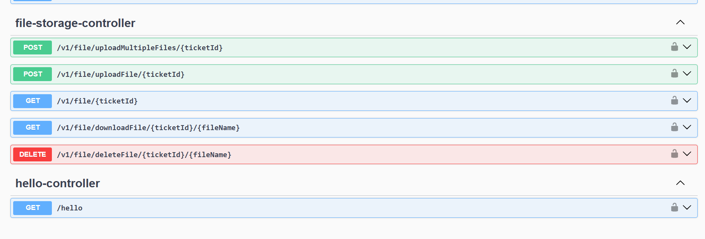

### PAINEL DE GERENCIAMENTO DE GARANTIAS E DIVERGÊNCIAS - BACKEND (SPRING BOOT)

### Quais implementações foram feitas?

* Implementação da funcionalidade
  de [Login e autenticação de usuários, criação de tickets de garantia e divergências, envio de arquivos, envio de mensagens nos tickets, atualização de status dos tickets].
* Desenvolvimento do módulo de [envio de ticket garantia e divergência.].
* Configuração inicial do banco de dados com as tabelas principais.
* Adição das dependências principais (`mysql`, etc.).
* Envio de arquivos (imagens, documentos, etc.) para o servidor.
* Implementação de autenticação via JWT usando o Spring Security.
* Configuração do Swagger para documentação da API.
* Configuração do CORS para permitir requisições de diferentes origens.
*
    * Criação dos endpoints principais da API.

### Como usar?

**1. Preparar o Banco de Dados (MySQL com Docker):**

* Se você não possui o MySQL instalado, execute o comando abaixo no seu terminal para criar um container Docker com uma
  instância do MySQL 8 ou caso nao tenha o docker, baixe o mysql na sua máquina:
    ```bash
    docker run --name mysql-db-test -p 3306:3306 -e MYSQL_ROOT_PASSWORD=sua_senha_secreta -e MYSQL_DATABASE=nome_do_seu_banco -d mysql:8.0
    ```
  *(**Observação:** Lembre-se de trocar `sua_senha_secreta` e `nome_do_seu_banco` pelos valores que seu projeto
  espera)*.

**2. Configure a Conexão com o Banco**

* Na pasta `src/main/resources/`, abra o arquivo `application.properties`.
* Edite as seguintes linhas para que elas correspondam aos dados do seu banco de dados:
    ```properties
    spring.datasource.url=jdbc:mysql://${DATABASE_HOST}:3306/${DATABASE_NAME:PAINEL_ADMINISTRATIVO}?allowPublicKeyRetrieval=true&useSSL=false&zeroDateTimeBehavior=CONVERT_TO_NULL
    spring.datasource.username=root
    spring.datasource.password=sua_senha_secreta
    spring.jpa.hibernate.ddl-auto=update
    file.upload-dir=${FILE_UPLOAD_DIR} //pasta para upload de arquivos
    api.security.jwt.secret-key=${JWT_SECRET_KEY} //chave secreta para JWT
    ```
    ```

**3. Baixar e Compilar o Projeto:**

* Clone o repositório e entre na branch correta:
    ```bash
    git clone https://github.com/oswaldomauricio/API_PAINEL_ADMINISTRATIVO_SPRING_BOOT.git
    cd [PASTA_DO_PROJETO_NO_SEU_COMPUTADOR]
    git checkout v1/featured
    ```
* Use o Maven para compilar o projeto e baixar todas as dependências:
    ```bash
    mvn clean install
    ```

**4. Executar a Aplicação:**

* Inicie o servidor Spring Boot com o seguinte comando Maven:
    ```bash
    mvn spring-boot:run
    ```
* Aguarde o console mostrar que a aplicação foi iniciada com sucesso na porta `8081`.

**5. Verificar o Endpoint de Login:**

* Abra seu navegador, ou uma ferramenta como Postman/Insomnia, e faça uma requisição para o endpoint de login:
    * **URL:** `http://localhost:8081/swagger-ui/index.html#`
    * **Método:** `POST`
* Verifique se a aplicação retorna o status esperado (Ex: `200 OK` em caso de sucesso ou `401 Unauthorized` com
  credenciais inválidas) e o corpo da resposta esperado.

### Swagger - documentação de rotas

* Acesse a documentação interativa da API via Swagger:
    * **URL:** `http://localhost:8081/swagger-ui/index.html#`

* Popule a tabela de lojas com algumas lojas de exemplo:
    ```sql
    INSERT INTO `lojas_information` (`id`, `cidade`, `created_at`, `email`, `endereco_loja`, `estado`, `horario`, `latitude`, `loja`, `longitude`, `nome_loja`, `segmentacao`, `segmentacao2`, `sigla`, `telefone`, `whatsapp`) VALUES ('1', 'Manaus', '2025-09-09 17:22:04.000000', 'faturamento@norteautopecas.com.br', 'Av. Torquato Tapajós, 923, bairro da paz Manaus/AM', 'Amazonas', 'Segunda a Sexta: 8h as 18h | Sábado: 8h as 16h | domingo 8h as 12h\r\n', '0', '101', '0', 'Norte - Matriz', 'LINHA PESADA', NULL, 'AM', '(92) 2129-1500', '(92) 98112-8981\r\n');
  ```
  
* crie um usuario padrão para conseguir fazer outras requisições iniciais.
  ```sql
    INSERT INTO `users` (`id`, `created_at`, `login`, `role`, `senha`, `updated_at`) VALUES (NULL, '2025-09-11 11:15:29.000000', 'usuario', 'ROLE_USER', '{bcrypt}$2a$12$xr0nccZo7li94EMQdR08De3blyiIdbgOCyboezi2lq5FkfntD55oO', '2025-09-11 11:15:29.000000');
  ```
  login = usuario |  senha = 123456




